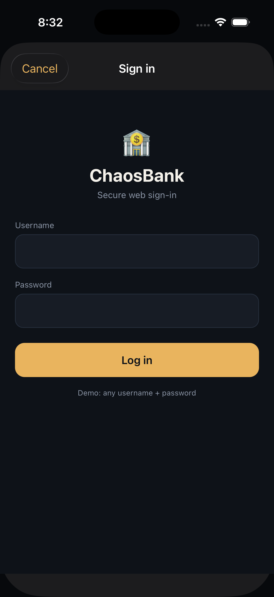
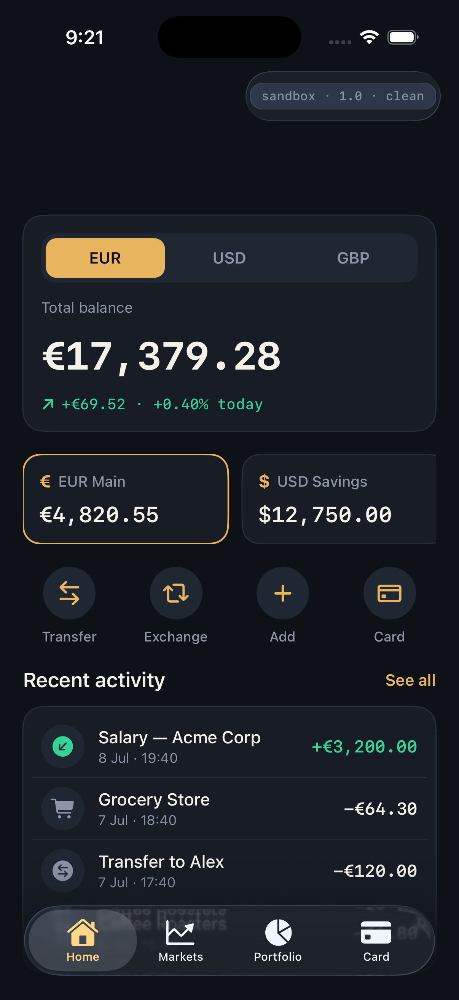
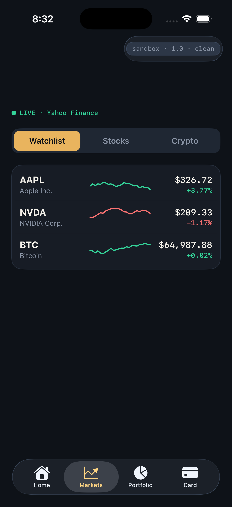
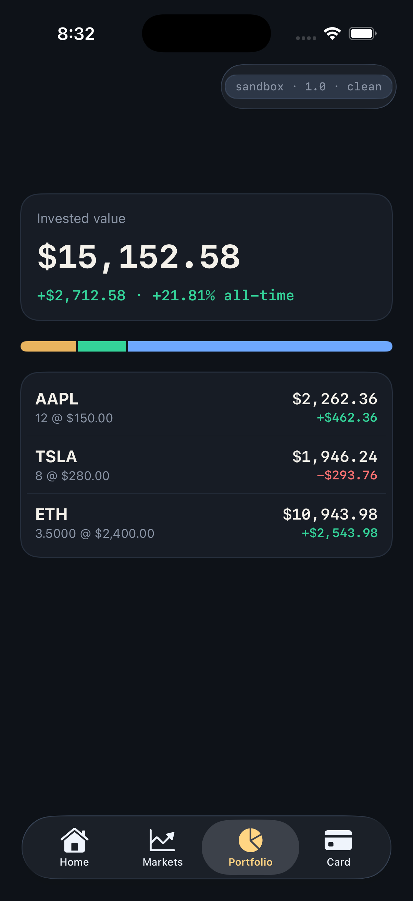
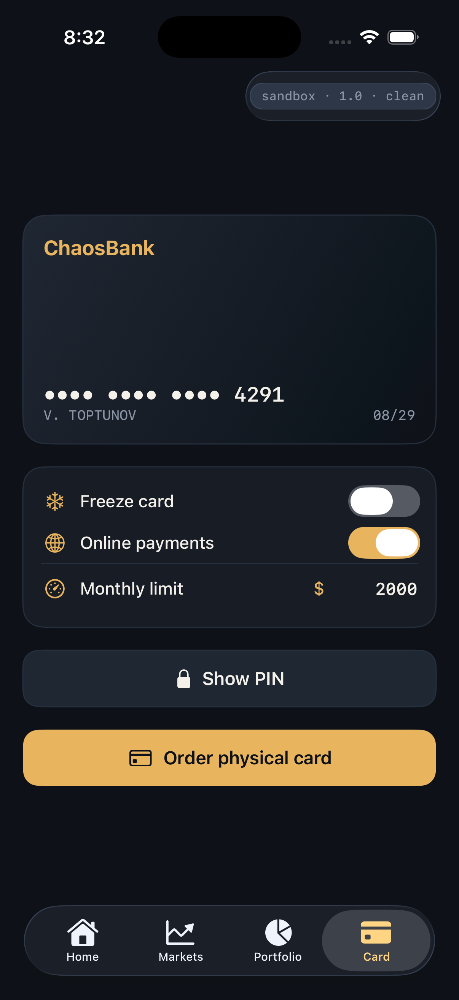
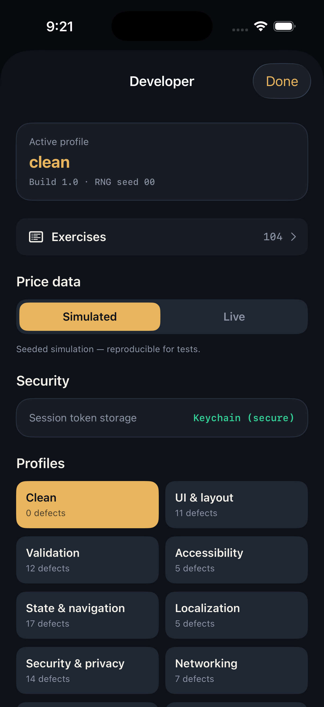

# ChaosBank

> A deliberately-buggy iOS neobank **+** broker, built as a controlled practice
> range for mobile QA / SDET automation.

ChaosBank looks and behaves like a real fintech product (a Revolut/Robinhood-style
hybrid of a bank and a stock/crypto broker), but it exists for one purpose: to give
test-automation engineers a realistic app to **write UI tests against** — with
known, switchable defects planted across every layer: UI, state, validation,
localization, concurrency, networking, security, accessibility and performance.


---

## Screenshots

| Web login | Home | Markets (live) |
|---|---|---|
|  |  |  |

| Portfolio | Card | Developer menu |
|---|---|---|
|  |  |  |

---

## The core idea: correct code and bugs are separated

This is the most important rule in the project.

**Production logic is always written correctly.** Money math, order pricing,
balance updates — the reference implementation is the correct one. Defects are
never baked into the core; they are injected at explicit, guarded points behind a
single query:

```swift
if Defects.isActive(.doubleCharge) {
    // small, isolated buggy override
}
```

Why this matters:

- **Regression training works.** Write a test against the clean baseline (it
  passes), flip a profile that activates the defect, re-run (it fails). The test
  proved it catches the regression.
- **The clean build is a real, correct app.** Profile `clean` = zero defects.
- **Locators never move.** A defect changes *behavior or values*, never the
  accessibility-identifier surface, so tests stay stable across builds. Every
  identifier lives in one file (`Core/A11y.swift`).
- **Determinism.** All randomness (the price walk, race-condition coin flips)
  derives from the build seed, so runs reproduce — except the opt-in **live**
  price feed, which is intentionally non-deterministic.

---

## Bug configuration engine

Bugs are enabled by **configuration**, not by separate builds. A build activates a
set of defects via a named **profile**, a numeric **seed**, or an explicit list —
chosen at launch or switched live in the in-app **developer menu** (long-press /
triple-tap the build badge).

### Profiles

| Profile | Contents |
|---|---|
| `clean` | no defects (passes the full reference suite) |
| `ui`, `validation`, `accessibility`, `state`, `localization`, `security`, `network` | all defects in that category |
| `flaky` | concurrency / race-condition defects (seed-pinned) |
| `beginner`, `middle`, `senior` | curated difficulty bundles |
| `all` | every defect at once |

### Launch arguments

```bash
# Profiles / seeds / explicit defects
-ChaosBankProfile flaky
-ChaosBankSeed 7                 # or env CHAOSBANK_SEED
-ChaosBankDefects doubleCharge,roundingDrift

# Real vs simulated market data
-ChaosBankPriceSource live       # or 'simulated' (default) / env CHAOSBANK_PRICE_SOURCE

# Test / demo affordances (never change product behavior)
-ChaosBankStartUnlocked 1        # skip the auth ladder
-ChaosBankTab markets            # deep-link a tab: home|markets|portfolio|card
-ChaosBankShowDev 1              # auto-open the developer menu
-ChaosBankShowWebLogin 1         # auto-open the web login sheet
```

---

## Defect catalog (104 defects, 10 categories)

Every defect ships **OFF** in the `clean` profile. Counts by category: money 22,
state 17, security 14, validation 12, ui 11, network 7, performance 6,
concurrency 5, localization 5, accessibility 5. The **complete, machine-readable
list** is in [`exercises.json`](exercises.json) (one exercise per defect); the
table below is a representative selection.

| Category | Defect | What it breaks |
|---|---|---|
| **Money** | `roundingDrift` | stored amount drifts from displayed (Double vs Decimal) |
| | `pnlSign` | a loss renders as a gain |
| | `exchangeFeeNotApplied` | credited amount ignores the displayed fee |
| | `pnlPercentVsValue` | P&L % divides by market value, not cost |
| | `homeTotalOmitsAccount` | total balance omits the GBP account |
| **Validation** | `limitValidation` | zero/negative qty & bad limit orders accepted |
| | `zeroAmountAccepted` | zero-amount transfer allowed |
| | `whitespaceRecipient` | recipient whitespace not trimmed |
| | `passcodeWeakAccepted` | short passcode accepted (4 vs 6) |
| | `amountExceedsBalanceAllowed` | transfer over the balance allowed client-side |
| **Localization** | `localeParse` | `1,000.50` parsed as `1.0005` |
| | `dateTimezoneShift` | transaction dates shifted by timezone |
| **State** | `staleBalance` | dashboard shows the pre-transfer balance |
| | `paginationDup` | a transaction duplicated after Load more |
| | `cardToggleInvert` | freeze toggle reads back inverted |
| | `filterLeaksCategory` | Money-in filter leaks money-out rows |
| | `orderStuckPending` | a filled order still shows pending |
| **Concurrency** | `doubleCharge` | rapid double-tap sends the transfer twice |
| | `livePriceRace` | order price ≠ the tapped price |
| | `orderDoubleSubmit` | rapid double-tap places two orders |
| | `exchangeDoubleSubmit` | rapid double-tap exchanges twice |
| **UI** | `disabledButtonTappable` | a disabled-looking button still fires |
| | `otpResendNoCooldown` | OTP resend ignores its cooldown |
| | `successToastMissing` | no confirmation toast after a transfer |
| **Accessibility** | `duplicateAssetA11yId` | two market rows share one identifier |
| | `missingA11yLabel` | Place-order button has no accessibility label |
| | `wrongA11yLabel` | Buy button is labelled "Sell" |
| **Security** | `authBypass` | gate skipped after backgrounding |
| | `noPrivacyBlur` | sensitive data visible in the app switcher |
| | `otpAcceptsExpired` | an expired OTP is still accepted |
| | `otpNoLockout` | no lockout after repeated wrong OTP |
| | `sessionTimeoutDisabled` | idle session never re-locks |
| | `tokenInUserDefaults` | session token stored in UserDefaults, not Keychain |
| | `cardNumberFullyVisible` | full card number shown unmasked |
| | `cardCvvVisible` | CVV shown on the card face |
| | `otpCodeInLog` | OTP code written to the console log |
| **Networking** | `retryDuplicate` | retry after a slow response double-posts |
| | `slowResponseRace` | a stale late response clobbers fresh state |
| | `timeoutAsSuccess` | a timeout is shown as a successful transfer |
| | `staleOfflineBalance` | offline cache serves an outdated balance |
| **Performance** | `transactionsHeavyList` | huge non-lazy, non-paginated list hitches |
| | `mainThreadStall` | Portfolio blocks the main thread on open |
| | `feedPollsTooOften` | live feed polls 10× too often |
| | `transactionsSortEveryRender` | history re-sorts on every render |

---

## Machine-readable exercise catalog

Every defect has a matching **exercise**, exported to [`exercises.json`](exercises.json)
(source of truth: `Core/Exercises/Exercise.swift`). Each entry is a self-contained
task with everything a tester needs:

```json
{
  "id": "IOS-CON-01",
  "title": "Rapid double-tap sends twice",
  "difficulty": "senior",
  "category": "concurrency",
  "feature": "Transfer",
  "defects": ["doubleCharge"],
  "launchArgument": "-ChaosBankDefects doubleCharge",
  "expectedClean": "Idempotent — one transaction.",
  "expectedBuggy": "Two transactions (double charge).",
  "task": "Rapidly double-tap Confirm; assert exactly one transaction / one debit.",
  "keyLocators": ["transfer.confirmButton", "home.totalBalance"]
}
```

The in-app **Developer → Exercises** browser lists them by difficulty and can apply
any exercise's defect(s) live.

---

## Features

- **Bank** — Home dashboard (currency-switchable balance), Transfer (+ confirmation
  sheet, idempotency, retry), Exchange (live FX, fees), Transactions (search /
  filter / pagination).
- **Broker** — Markets (live ticking prices, sparklines), Asset detail, Order
  ticket (market / limit lifecycle), Portfolio (live P&L, allocation).
- **Card** — freeze / online-payments toggles, limits, PIN.
- **Auth ladder** — **web login** (a `WKWebView` sheet — deliberately reached via a
  web context, not native locators) → **OTP** (resend cooldown, expiry,
  auto-submit, lockout) → **6-digit passcode** → **Face ID** fallback, plus
  background re-lock and idle session timeout.
- **Live market data** — real quotes from the public Yahoo Finance endpoint
  (no API key). Off by default so the reference defects stay reproducible.

---

## Money & determinism

- `Decimal` everywhere for money — the single exception is the `roundingDrift`
  defect, which deliberately routes one calculation through `Double`.
- Seeded RNG (`SeededRNG`, SplitMix64) drives the price walk and race probabilities.
- The build badge always shows the real active profile/seed on screen.

---

## Project structure

```
ChaosBank/
├── App/            entry, RootView, tab shell, auth flow, launch options
├── Core/
│   ├── A11y.swift          ALL accessibility identifiers (single source)
│   ├── Defects/            DefectID, Defect, categories, registry, profiles, BuildConfig
│   ├── Money/              Decimal money, currency, FX, locale-aware parsing
│   ├── Feed/               seeded PriceFeed + live Yahoo source + MarketStore
│   ├── Backend/            in-memory MockBackend actor + network scenarios
│   └── Exercises/          machine-readable exercise catalog
├── DesignSystem/   color/type tokens, components (live ticker, sparkline…)
├── Models/         Account, Transaction, Asset, Quote, Holding, Order, seed data
└── Features/       Home, Transfer, Exchange, Transactions, Markets, AssetDetail,
                    Order, Portfolio, Card, Auth, Dev
exercises.json      generated machine-readable catalog
docs/screenshots/   images used by this README
```

No third-party dependencies in the app target.

---

## Build & run

Requires Xcode 26+ and an iOS 17+ simulator.

```bash
open ChaosBank.xcodeproj
# ⌘R, or:
xcodebuild -project ChaosBank.xcodeproj -scheme ChaosBank \
  -destination 'platform=iOS Simulator,name=iPhone 17' build
```

Run a specific scenario:

```bash
xcrun simctl launch <device> VadimToptunov.ChaosBank -ChaosBankProfile flaky
```

---

## Roadmap

- Reference test suites in parallel folders (XCUITest / Swift Testing / KassiOS /
  Appium / Maestro) — the app is ready for them: stable locators, `exercises.json`,
  and the launch-argument contract above.
- More performance & concurrency scenarios.

## License

TBD — add a license before publishing.
